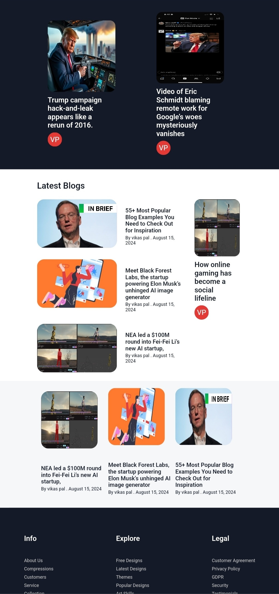
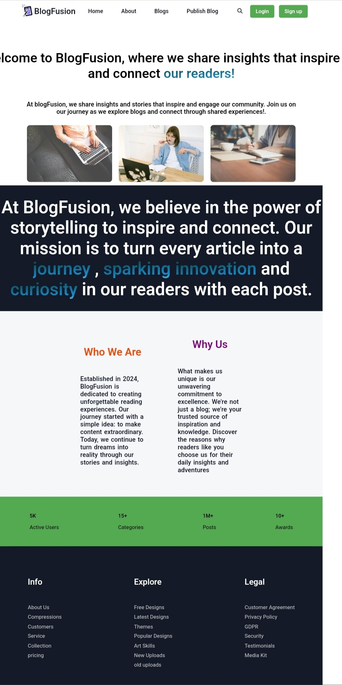
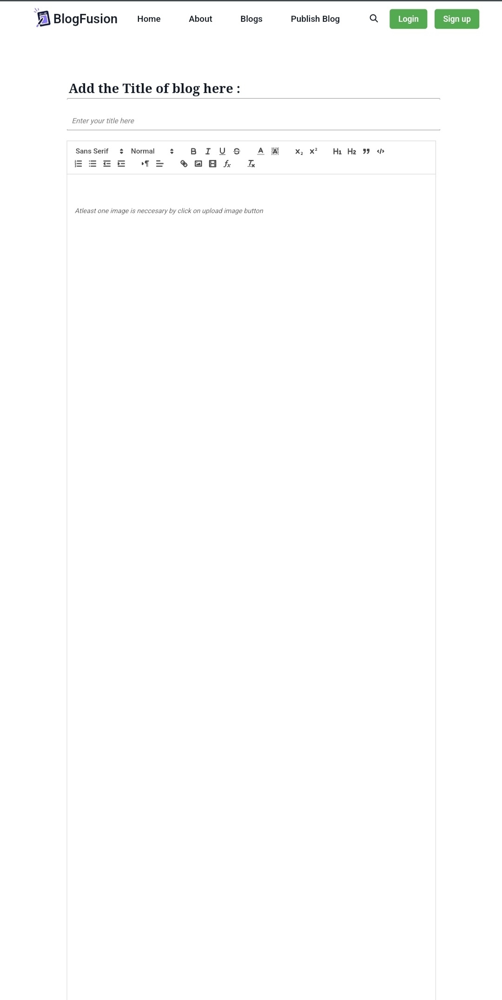
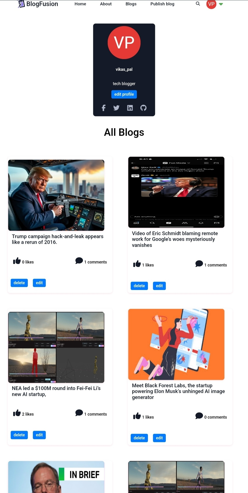

# Blog Fusion
 A dynamic platform for sharing insightful articles across various topics, allowing users to explore, comment, and engage with a vibrant community. Stay updated with featured, trending, and latest blogs, all in one place
 
# Screenshots

# Hosted URL
 https://blogfusion8923-git-main-vikaspal8923s-projects.vercel.app/

# Features Implemented
## Frontend
1. home page consisting of latest blog,trending blog and features blogs.

2. header includes login and signup of users and also provides search functionality without login.

3. Blog pages consiting of all blog of all users.

4. Publish blog page where anyone can create thier blogs after login/signup.

5. Preview blog page showing a particular blog when you click on a blog title using post id given in url and if click on author name given on this page then you will redirect to author progile.

6. dashboard include user profile with edit profile  and all blogs with edit,delete functionality but owner of that blog can only seen these edit buttons

7. 

## Backend

### User Authentication & Authorization

  -  Secure user authentication with JWT (JSON Web Tokens).
  -   User signup and login functionalities.

**Blog Management**

  - **Create Blog**: Users can create and publish new blog posts.
  - **Edit Blog**: Users can edit their existing blog posts.
  - **Delete Blog**: Users can delete their own blog posts.
  - **Show All Blogs**: View all published blogs on the platform.
  - **Latest Blogs**: Display the most recent blog posts.
  - **Featured Blogs**: Highlight specific blogs as featured content.
  - **Trending Blogs**: Display blogs that are trending based on views and interactions.

**Interactivity**

  - **Like/Unlike Blog**: Users can like or unlike blog posts.
  - **Comment on Blog**: Users can add comments to blog posts, facilitating interaction and discussion.

**Comment Management**: Users can view all comments associated with a blog.

**Media Management**

  - **Cloudinary Integration**: All blog images and media files are managed and stored using Cloudinary.

# Technologies/Libraries/Packages Used

## Technologies/Libraries/Packages Used for backend
1. Technologies/Libraries/Packages Used

2. bcrypt: ^5.1.1 - For hashing passwords securely.

3. cloudinary: ^2.2.0 - For image and video storage and management.

4. cookie-parser: ^1.4.6 - To parse cookies attached to client requests.

5. cors: ^2.8.5 - To enable Cross-Origin Resource Sharing (CORS).

6. dotenv: ^16.4.5 - To load environment variables from a .env file.

7. express: ^4.19.2 - A web application framework for Node.js.

8. express-fileupload: ^1.5.1 - Middleware for handling file uploads.

9. file-uploader: ^1.0.0 - For managing file uploads in the project.

10. jsonwebtoken: ^9.0.2 - To generate and verify JSON Web Tokens (JWT).

11. mongoose: ^8.5.1 - An Object Data Modeling (ODM) library for MongoDB and Node.js.

12. multer: ^1.4.5-lts.1 - Middleware for handling multipart/form-data, primarily used for file uploads.

13. nodemailer: ^6.9.14 - To send emails from your Node.js applications.

14. nodemon: ^3.1.4 - A tool that helps develop Node.js applications by automatically restarting the server when file changes are detected.

15. otp-generator: ^4.0.1 - For generating one-time passwords (OTPs).

## Technologies/Libraries/Packages Used for fontend
- **JWT Decode**: A small browser library that helps decode JSON Web Tokens (JWT) without verifying the signature.
- **Axios**: A promise-based HTTP client for making requests to servers, used for interacting with APIs.
- **Font Awesome**: A popular icon toolkit that provides scalable vector icons that can be customized using CSS.
- **Toastr.js**: A JavaScript library for displaying non-blocking notifications.
- **jQuery**: A fast, small, and feature-rich JavaScript library that simplifies HTML document traversal, event handling, and animation.
- **JWT Decode**: A small browser library that helps decode JSON Web Tokens (JWT) without verifying the signature.

# Local Setup

1. first go to backend and run backend by npm run dev before running backend change vp file to .env and uncomment the whole code of vp file and paste in .env file.
2. when you want to craete new blog one image upload it compalsory

# Team Members

1. Vikas pal (2023img-055)
2. Aryan meena (2023bms-005)
3. Anurag singh (2023bcs-010)
